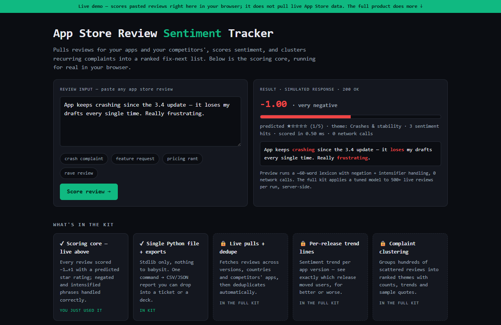

# App Store Review Sentiment Tracker — live demo

  

  <a href="https://amos-mig.github.io/app-store-review-sentiment-tracker-demo/"><strong>▶ Open the live demo</strong></a> ·
  <a href="https://amosmign.gumroad.com/l/app-store-review-sentiment-tracker"><strong>Get the full product · €29</strong></a>

## What this is

A working in-browser slice of the App Store Review Sentiment Tracker: paste or pick an app review and a mini lexicon really scores it from −1 to +1, predicts a star rating, highlights sentiment words (with negation and intensifier handling), and assigns a complaint theme. The rest — live App Store pulls, cross-version dedupe, trend lines, competitor tracking — is shown as locked cards plus a partial CLI transcript.

**Try it:** Click the preset chips (crash complaint, feature request, pricing rant, rave) and hit Score review, then edit the text yourself — try adding 'not' before a positive word or 'very' before a complaint and watch the score, stars, and theme flip.

## What you get in the full product

- Fetches and deduplicates reviews across versions
- Sentiment scoring with trend lines per release
- Clusters recurring complaints and feature requests
- Competitor app tracking included
- Single Python file with CSV/JSON export

## About

- **Storefront:** [kits.amosmignery.dev](https://kits.amosmignery.dev) — single-file products, instant download, commercial license
- **Checkout:** [Gumroad](https://amosmign.gumroad.com/l/app-store-review-sentiment-tracker) (Merchant of Record, VAT handled)
- **Full product:** [App Store Review Sentiment Tracker](https://amosmign.gumroad.com/l/app-store-review-sentiment-tracker) · €29

## License

The demo page in this repo is MIT-licensed — reuse the technique, not the product.
The **App Store Review Sentiment Tracker** itself is not included here and is not free software.
